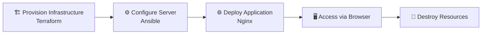
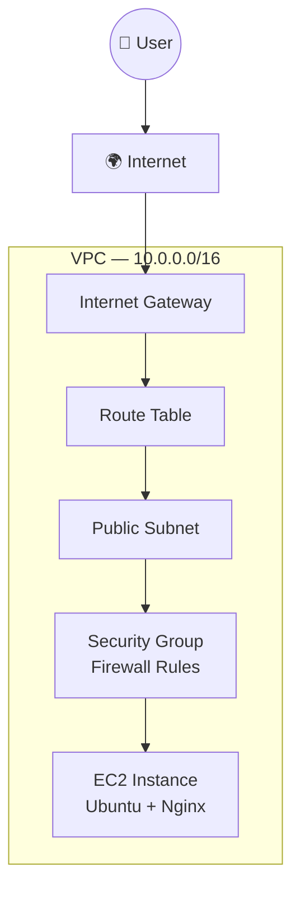

<div align="center">

# 🚀 DevOps Rescue Lab

**End-to-end DevOps project demonstrating infrastructure provisioning, configuration management, and application deployment.**


</div>

---

## 📑 Table of Contents

- [Workflow](#-workflow)
- [Architecture](#-architecture)
- [Tech Stack](#-tech-stack)
- [Screenshots](#-screenshots)
- [Terraform Workflow](#️-terraform-workflow)
- [What Terraform Creates](#️-what-terraform-creates)
- [Networking Basics](#-networking-basics)
- [Security Group Rules](#-security-group-rules)
- [Ansible Deployment](#️-ansible-deployment)
- [Final Output](#-final-output)
- [Cleanup](#-cleanup-important)
- [FAQ](#-faq-interview-style)
- [Author](#-author)

---

## 📌 Workflow



## 📸 Architecture



---

## 🧰 Tech Stack

| Category | Tools |
|---|---|
| ☁️ Cloud | AWS (EC2, VPC, Subnets, IGW, Security Groups) |
| 🏗️ Infrastructure as Code | Terraform |
| ⚙️ Configuration Management | Ansible |
| 🖥️ OS | Ubuntu Server 22.04 |
| 🌐 Web Server | Nginx |
| 🔧 Version Control | Git + GitHub |

---

## 📸 Screenshots

> Add screenshots to the `/screenshots` folder and link them below.

| Step | Description |
|---|---|
| `terraform apply` | Infrastructure creation success |
| AWS EC2 Console | Running instance |
| Ansible Run | Nginx installation success |
| Browser Output | Nginx landing page |

---

## ⚙️ Terraform Workflow

```bash
# Initialize the working directory
terraform init

# Validate the configuration
terraform validate

# Preview the execution plan
terraform plan

# Apply the changes
terraform apply
```

## 🏗️ What Terraform Creates

- ✅ VPC (`10.0.0.0/16`)
- ✅ Public & Private Subnets
- ✅ Internet Gateway
- ✅ Route Table
- ✅ Security Group (HTTP, HTTPS, SSH)
- ✅ EC2 Instance (Ubuntu)

---

## 🌐 Networking Basics

| Concept | Description |
|---|---|
| **VPC** | Isolated network inside AWS |
| **Subnet** | Defines resource placement (public/private) |
| **Internet Gateway** | Allows internet access |
| **Route Table** | Controls traffic flow |

## 🔐 Security Group Rules

| Port | Protocol | Purpose |
|---|---|---|
| 22 | SSH | Remote access |
| 80 | HTTP | Web traffic |
| 443 | HTTPS | Secure traffic |

---

## ⚙️ Ansible Deployment

```bash
# Test connection
ansible -i inventory.ini web -m ping

# Install Nginx
ansible-playbook -i inventory.ini install-nginx.yml
```

### 🧠 What Ansible Does

- Connects via SSH
- Installs Nginx
- Starts the service
- Ensures idempotency

---

## 🌍 Final Output

```
http://<EC2_PUBLIC_IP>
```

Nginx web server is now live 🎉

---

## 🧹 Cleanup (IMPORTANT)

```bash
terraform destroy
```

Removes:
- EC2 instance
- VPC
- Subnets
- Security groups
- Internet Gateway

> 💡 Always destroy resources after testing to avoid unnecessary AWS charges.

---

## ❓ FAQ (Interview Style)

### ☁️ AWS & Infrastructure Basics

<details>
<summary><b>What is EC2?</b></summary>
<br>
EC2 (Elastic Compute Cloud) is a virtual server in AWS used to run applications — just like a physical computer, but hosted in the cloud.
</details>

<details>
<summary><b>What is a VPC?</b></summary>
<br>
A Virtual Private Cloud (VPC) is an isolated network in AWS where all resources (EC2, subnets, gateways) live.
</details>

<details>
<summary><b>What is a subnet, and why does EC2 need one?</b></summary>
<br>
A subnet defines the network location of an instance inside a VPC, and determines whether it's public or private. EC2 needs a subnet so AWS knows where to place it on the network.
</details>

<details>
<summary><b>What is an Internet Gateway?</b></summary>
<br>
It allows communication between resources inside a VPC and the internet.
</details>

<details>
<summary><b>What is a Route Table?</b></summary>
<br>
It controls traffic flow inside a VPC and decides where network traffic should go.
</details>

<details>
<summary><b>What's the difference between an AMI and an Instance Type?</b></summary>
<br>

- **AMI (Amazon Machine Image)** — the template used to launch an EC2 instance (the operating system image)
- **Instance Type** — defines the hardware resources, like CPU, RAM, and performance level
</details>

<details>
<summary><b>What is a Key Pair, and why is it needed?</b></summary>
<br>
A Key Pair is a private/public key used for SSH authentication into EC2, allowing you to securely log in without a password.
</details>

### 🔐 Security Groups & Networking

<details>
<summary><b>What is a Security Group?</b></summary>
<br>
A virtual firewall that controls inbound and outbound traffic to an instance.
</details>

<details>
<summary><b>Why do we still need a Security Group if we already have a VPC and Subnet?</b></summary>
<br>

Each layer plays a different role:
- **VPC** → network boundary
- **Subnet** → placement zone
- **Security Group** → traffic control (who can enter, on which port)

The Security Group is the final access layer before the instance.
</details>

<details>
<summary><b>What are ports 22, 80, and 443 used for?</b></summary>
<br>

- **22 (SSH)** — remote access to manage the server securely
- **80 (HTTP)** — normal web browsing traffic
- **443 (HTTPS)** — encrypted, secure web traffic
</details>

<details>
<summary><b>Why is outbound traffic usually left open?</b></summary>
<br>

Because servers need to:
- download updates
- install packages
- access external APIs
</details>

### ⚙️ Terraform Concepts

<details>
<summary><b>What is Terraform, and why use it over manual AWS setup?</b></summary>
<br>

Terraform is a tool for defining and managing infrastructure as code. Compared to manual setup, it provides:
- repeatability
- automation
- version control
- consistency across environments
</details>

<details>
<summary><b>Why is Terraform syntax split into many blocks?</b></summary>
<br>

Because Terraform is declarative — each block represents one resource, each resource is managed independently, and dependencies are resolved automatically.
</details>

<details>
<summary><b>Why did <code>terraform init</code> take time or sometimes hang?</b></summary>
<br>

Usually due to provider plugin downloads (the AWS SDK for Terraform), slow network latency, or a first-time plugin install.
</details>

<details>
<summary><b>Why do we add <code>.terraform/</code> to <code>.gitignore</code>?</b></summary>
<br>

Because it contains downloaded provider plugins and large cached binaries (sometimes hundreds of MB) that GitHub will reject and that should never be committed.
</details>

<details>
<summary><b>Why did <code>terraform destroy</code> fail initially, or show "no credentials found"?</b></summary>
<br>

Typically because the provider plugins weren't initialized yet, or because AWS credentials weren't configured in the environment or CLI.
</details>

### 🧪 EC2 & Deployment

<details>
<summary><b>Why did EC2 creation fail before, and succeed later?</b></summary>
<br>

Usually a combination of: missing credentials/config, the AWS provider not being fully initialized, or incomplete networking/security rules.
</details>

<details>
<summary><b>Why does EC2 need both a subnet and a security group?</b></summary>
<br>

The **subnet** determines the network location, while the **security group** determines the traffic rules. Both are required for correct networking and access control.
</details>

### ⚙️ Ansible Concepts

<details>
<summary><b>What is Ansible, and what does it do in this project?</b></summary>
<br>

Ansible is a configuration management tool used to automate server setup. In this project it connects to EC2 over SSH, installs Nginx, and starts the service.
</details>

<details>
<summary><b>What does <code>ansible ... -m ping</code> do?</b></summary>
<br>

It tests SSH connectivity to a remote host.
</details>

<details>
<summary><b>Why did SSH initially fail, and why did it work after a retry?</b></summary>
<br>

The first failure was usually a host key verification mismatch. It succeeded afterward once the SSH fingerprint was accepted and stored.
</details>

### 🧠 Debugging Notes

<details>
<summary><b>Why did the AWS CLI install fail in Codespaces?</b></summary>
<br>

Because the `awscli` package name/version differs in the default Ubuntu repository.
</details>

<details>
<summary><b>Why did <code>git push</code> fail with a large file error?</b></summary>
<br>

Because a Terraform provider binary (~800MB) was accidentally tracked by Git instead of being ignored.
</details>

### 🧹 Cost & Cleanup

<details>
<summary><b>Why do we run <code>terraform destroy</code>, and what does it remove?</b></summary>
<br>

Running it prevents AWS from billing for unused resources. It removes the EC2 instance, VPC, subnets, security groups, route tables, and the Internet Gateway.
</details>

### 🚀 DevOps Concepts

<details>
<summary><b>What is Infrastructure as Code?</b></summary>
<br>
Managing infrastructure using code instead of manual setup.
</details>

<details>
<summary><b>What is Configuration Management?</b></summary>
<br>
Automating software installation and server setup.
</details>

<details>
<summary><b>What's the full DevOps flow in this project?</b></summary>
<br>

```
Terraform → AWS Infrastructure
Ansible   → Server Configuration
Nginx     → Application Layer
Browser   → Validation
Destroy   → Cost Control
```
</details>

---

## 👤 Author

**Nkechi Anna Ahanonye**
DevOps Engineer | Cloud & Automation
