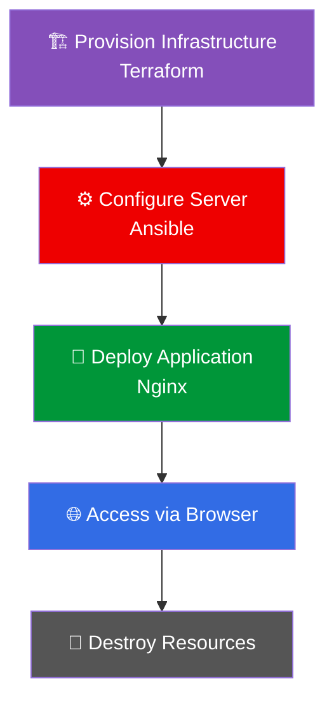
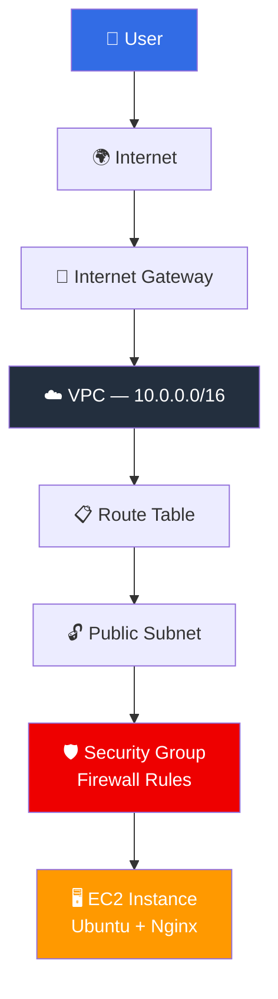

<div align="center">

# 🚀 DevOps Rescue Lab

**End-to-end DevOps project demonstrating infrastructure provisioning, configuration management, and application deployment**


</div>

---

## 📑 Table of Contents

- [Workflow](#-workflow)
- [Architecture](#-architecture)
- [Tech Stack](#-tech-stack)
- [Screenshots](#-screenshots)
- [Terraform Workflow](#️-terraform-workflow)
- [What Terraform Creates](#️-what-terraform-creates)
- [Networking Basics](#-networking-basics)
- [Security Group Rules](#-security-group-rules)
- [Ansible Deployment](#️-ansible-deployment)
- [What Ansible Does](#-what-ansible-does)
- [Final Output](#-final-output)
- [Cleanup](#-cleanup-important)
- [FAQ](#-faq-interview-style)
- [Author](#-author)

---

## 📌 Workflow



---

## 📸 Architecture



---

## 🧰 Tech Stack

| Category | Tools |
|---|---|
| ☁️ **Cloud Provider** | AWS (EC2, VPC, Subnets, IGW, Security Groups) |
| 🏗️ **Infrastructure as Code** | Terraform |
| ⚙️ **Configuration Management** | Ansible |
| 🖥️ **Operating System** | Ubuntu Server 22.04 |
| 🌐 **Web Server** | Nginx |
| 📦 **Version Control** | Git + GitHub |

---

## 📸 Screenshots

> 💡 Add your screenshots to the `/screenshots` folder and update the table below.

| Step | Description | Preview |
|---|---|---|
| 🏗️ Terraform Apply | Infrastructure creation success | `/screenshots/terraform-apply.png` |
| ☁️ AWS EC2 | Running instance | `/screenshots/aws-ec2.png` |
| ⚙️ Ansible Run | Nginx installation success | `/screenshots/ansible-run.png` |
| 🌐 Browser Output | Nginx landing page | `/screenshots/browser-output.png` |

---

## ⚙️ Terraform Workflow

**1. Initialize**
```bash
terraform init
```

**2. Validate**
```bash
terraform validate
```

**3. Plan**
```bash
terraform plan
```

**4. Apply**
```bash
terraform apply
```

---

## 🏗️ What Terraform Creates

- ✅ VPC (`10.0.0.0/16`)
- ✅ Public & Private Subnets
- ✅ Internet Gateway
- ✅ Route Table
- ✅ Security Group (HTTP, HTTPS, SSH)
- ✅ EC2 Instance (Ubuntu)

---

## 🌐 Networking Basics

| Component | Description |
|---|---|
| **VPC** | Isolated network inside AWS |
| **Subnet** | Defines resource placement (public/private) |
| **Internet Gateway** | Allows internet access |
| **Route Table** | Controls traffic flow |

---

## 🔐 Security Group Rules

| Port | Protocol | Purpose |
|:---:|:---:|---|
| 22 | SSH | Remote access |
| 80 | HTTP | Web traffic |
| 443 | HTTPS | Secure traffic |

---

## ⚙️ Ansible Deployment

**Test Connection**
```bash
ansible -i inventory.ini web -m ping
```

**Install Nginx**
```bash
ansible-playbook -i inventory.ini install-nginx.yml
```

---

## 🧠 What Ansible Does

- 🔌 Connects via SSH
- 📦 Installs Nginx
- ▶️ Starts the service
- 🔁 Ensures idempotency

---

## 🌍 Final Output

```
http://<EC2_PUBLIC_IP>
```

✅ Nginx web server is now live.

---

## 🧹 Cleanup (IMPORTANT)

```bash
terraform destroy
```

**Removes:**
- 🖥️ EC2 instance
- ☁️ VPC
- 🔓 Subnets
- 🛡️ Security groups
- 🚪 Internet Gateway

> ⚠️ Always destroy resources after testing to avoid unnecessary AWS charges.

---

## ❓ FAQ (Interview Style)

<details>
<summary><strong>What is EC2?</strong></summary>
<br>
A virtual server in AWS used to run applications.
</details>

<details>
<summary><strong>Why subnet?</strong></summary>
<br>
Defines network segmentation and resource placement.
</details>

<details>
<summary><strong>What is a Security Group?</strong></summary>
<br>
A virtual firewall controlling inbound/outbound traffic.
</details>

<details>
<summary><strong>AMI vs Instance Type?</strong></summary>
<br>

- **AMI** → Operating system image
- **Instance Type** → CPU & memory size
</details>

<details>
<summary><strong>Why Terraform?</strong></summary>
<br>
Infrastructure as Code for repeatable deployments.
</details>

<details>
<summary><strong>Why Ansible?</strong></summary>
<br>
Automates server configuration and software setup.
</details>

<details>
<summary><strong>Why SSH?</strong></summary>
<br>
Remote access into the EC2 instance.
</details>

<details>
<summary><strong>Why destroy resources?</strong></summary>
<br>
To avoid unnecessary AWS charges.
</details>

---

## 👤 Author

<div align="center">

**Nkechi Anna Ahanonye**

*DevOps Engineer | Cloud & Automation*

</div>
